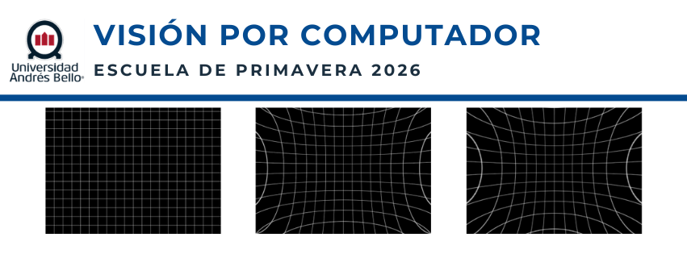

# Visión por Computador - Escuela de Primavera 2026 UNAB

Este repositorio contiene el material e itinerario para las clases prácticas del curso de **Visión por Computador**, dictado en la **Escuela de Primavera de la Universidad Andrés Bello (UNAB)**. El diseño curricular y los laboratorios han sido desarrollados por **Pamela Franco**.

El curso está especialmente diseñado para estudiantes y profesionales de las ciencias exactas e ingeniería (**Físicos, Astrónomos e Ingenieros Físicos**), abordando la disciplina desde una perspectiva formal, matemática, geométrica y computacional en Python.

---

## Acceso Directo a los Laboratorios (Google Colab)

Haz clic en los siguientes botones para abrir directamente los entornos interactivos de cada clase y comenzar a trabajar:

| Clase / Laboratorio | Botón de Acceso |
| :--- | :--- |
| **Práctico 1:** Fundamentos Matemáticos y Computacionales de la Visión por Computador | [](https://colab.research.google.com/github/pamelaFranco/vision_computador_UNAB/blob/main/Codigos/vision_por_computador2) |
| **Práctico 2:** Geometría Proyectiva y Calibración de Sistemas Ópticos | [](https://colab.research.google.com/github/pamelaFranco/vision_computador_UNAB/blob/main/Codigos/vision_por_computador2.ipynb) |
| **Práctico 3:** Deep Learning I - Clasificación y Detección de Objetos (CNN & YOLO) | [](https://colab.research.google.com/github/pamelaFranco/vision_computador_UNAB/blob/main/Codigos/vision_por_computador3.ipynb) |
| **Práctico 4:** Deep Learning II - Segmentación y Modelos Avanzados (U-Net & Transformers) | [](https://colab.research.google.com/github/pamelaFranco/vision_computador_UNAB/blob/main/Codigos/vision_por_computador4.ipynb) |

---

## Estructura Teórica y Descripción del Curso

El programa está estructurado para conectar las teorías clásicas de la óptica y la geometría formal con la visión por computador moderna, el procesamiento tensorial y las arquitecturas de aprendizaje profundo de última generación.

### 1. Procesamiento vs. Análisis de Imágenes
Se introduce formalmente la imagen como un operador matemático y como una matriz discreta de intensidades $I(x,y)$.
* **Procesamiento de Imágenes:** Algoritmos de entrada y salida de imágenes para restauración, filtrado lineal, convoluciones espaciales o mejora del contraste (ej. reducción de ruido térmico en sensores CCD).
* **Análisis de Imágenes:** Extracción de mediciones cuantitativas y reducción dimensional a partir de una escena (ej. fotometría o conteo de fuentes).
* **Visión por Computador:** Adquisición, procesamiento y comprensión profunda de datos bidimensionales y de alta dimensión para producir información simbólica y decisiones automatizadas.

### 2. Geometría Proyectiva y Óptica de la Cámara
Un recorrido por los hitos que permitieron modelar el espacio tridimensional mediante ecuaciones algebraicas lineales computables:
* Las bases geométricas de la perspectiva lineal, el plano cartesiano $(X, Y, Z)$ y las coordenadas homogéneas.
* El **Modelo de Cámara Pinhole** y la estimación de la matriz de proyección computacional.
* Parámetros **Intrínsecos** (distancia focal, punto principal, distorsión geométrica de lentes) y **Extrínsecos** (rotación y traslación en el espacio de tres dimensiones).

### 3. El Paradigma de Deep Learning en Ciencias Exactas
Transición desde los descriptores hechos a mano (*handcrafted features*) hacia la extracción automatizada y jerárquica de características complejas:
* **Redes Neuronales Convolucionales (CNN):** Procesamiento local invariantivo a la traslación mediante kernels optimizables.
* **Detección y Localización (YOLO):** Regresión directa de cajas delimitadoras (*bounding boxes*) y cálculo de métricas de precisión como *Intersection over Union* (IoU).
* **Segmentación Semántica (U-Net):** Arquitecturas con conexiones de salto (*skip connections*) para preservar la resolución espacial de estructuras complejas (ej. lesiones médicas o perfiles astronómicos).
* **Vision Transformers (ViT):** Aplicación de mecanismos de auto-atención (*self-attention*) para capturar dependencias globales no locales en imágenes.

```text
Objeto Real ──> Adquisición Óptica ──> Imagen I(x,y) ──> Convoluciones/Filtros ──> Redes Convolucionales ──> Segmentación/Detección ──> Decisión Científica

```


---

## Requisitos e Instalación

Para ejecutar los cuadernos de manera local, asegúrate de clonar el repositorio e instalar Python 3 junto con las siguientes dependencias científicas:

```bash
git clone [https://github.com/pamelaFranco/vision_computador_UNAB.git](https://github.com/pamelaFranco/vision_computador_UNAB.git)
cd vision_computador_UNAB
pip install numpy opencv-python matplotlib requests torch torchvision

```

> **Nota:** Para los cuadernos 3 y 4 que utilizan arquitecturas de Deep Learning, se recomienda fuertemente el uso de entornos con aceleración por GPU (disponibles de forma gratuita en los enlaces de Google Colab de arriba).
---

## License

[](https://opensource.org/licenses/MIT)
[](https://www.python.org/downloads/)